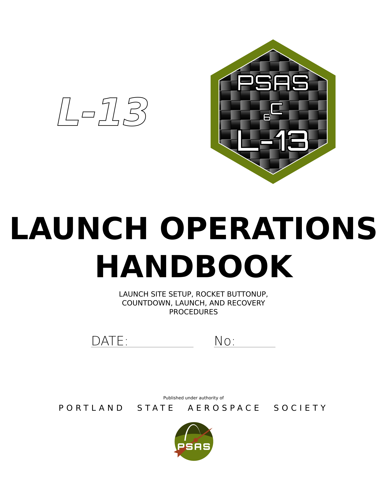

# PSAS Launch 13 Procedure Book
This contains the standard operating procedures, references, and support documentation for PSAS launces.
This is meant to be a checklist for everything needed to launch the current PSAS Level-3 rocket.
You can view an online version at:
<http://psas.github.io/procedure-book/>

If you visit that site on your phone or laptop, 
you can check off items as you go and see a progress bar of how much you've done.
However, __if you're a team lead you should use a physical booklet__ and check off tasks as you go.
It's important to have a persistent record of what's been done, 
and the website will reset its checklist if the page is reloaded!

## Editing
Team leaders are responsible (directly or indirectly) for keeping their sections up-to-date,
but everyone is welcome to help keep things accurate.
The source files are [markdown](http://daringfireball.net/projects/markdown/syntax). 

Please keep each major secion in it's own file for easier managment. 
Files can be editied in place using github's web interface, 
or simply clone the repo and open the files in your favorite text editor.

It's a good practice to make sure your images stay 
between 500 and 1000 px on the longest edge, and less than 1 MB.
This helps keep the repo small and reduce load times.
It can make a big difference when you're in the desert, sipping data through a 3G cell connection.

Check out [TODO.md](/TODO) if you're looking for ways to contribute.

## Building Locally
These dependencies should all be available on your package manager of choice: 

- [LaTeX](https://tug.org/texlive/)
    - The `pdfpages` package (probably included with your LaTeX distro)
    - The `pdflatex` command (probably included with your LaTeX distro)
- [pandoc](https://pandoc.org/) installed with LaTeX support.  
	**NOTE**: pandoc > 1.12.1 required to use the yaml_metadata_block format in common with jekyll
- [make](https://www.gnu.org/software/make/)
- [bc](https://www.gnu.org/software/bc/)
- [Bash](https://www.gnu.org/software/bash/)

If you really want, you can easily change the paper size in the Makefile, but everything uses US Letter paper as is.

### Making the Book
`make book.pdf`

Print this out double-sided and stick the first sheet (with the mission patch) in the front cover of a binder.
3-hole-punch the remaining sheets and fill the binder with them.
There should be a new version printed for each trip down to Brothers, 
except for when a launch is scrubbed and retried without altering the procedures.

### Making the Booklet
`make booklet.pdf` 

This makes a pocket-sized booklet.
Print this out double-sided (Make sure you're flipping on the correct edge!) 
and arrange the sheets into signatures with 8 sheets each.
Bind the booklet together according to your preference.

The easiest way to bind your booklet is to staple the sheets of a signature together,
and then attach the signatures together using a strong piece of tape (duct, gaffer's, Gorilla, et cetera).
