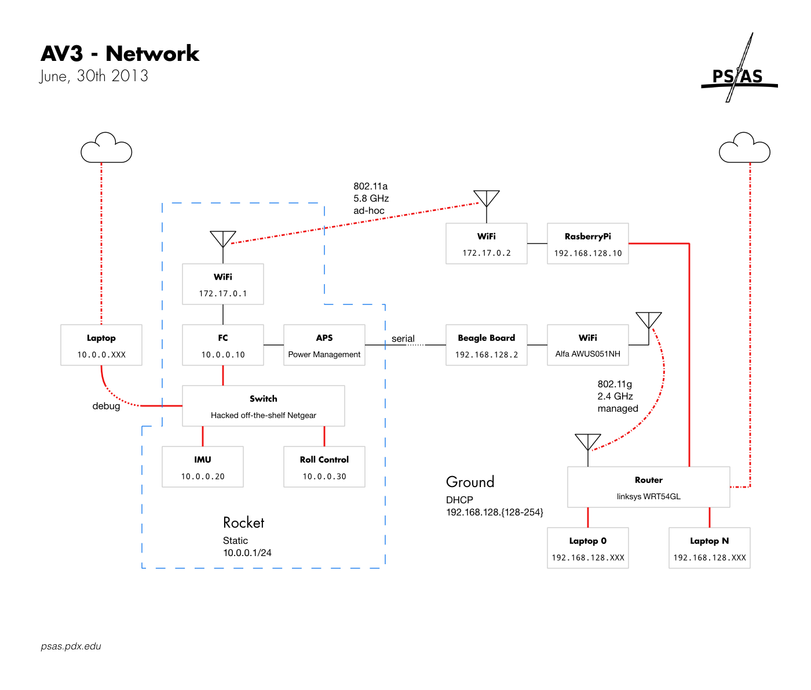

# Reference

## Radios

Standard comm frequencies:

 - 2-meter: **146.430 MHz**
 - FRS/GMRS: **Channel 5**

### Call Signs

 - `KD7CJT` Andrew
 - `KF7RAS` Nathan
 - `KJ7SU`  Glenn
 - `KC7KWX` Casey
 - `KF7VJX` Jenner
 - `KF7NLF` Kenny
 - `KG7DBF` Gavin

## Network

### Ground

 - AP offers DHCP `192.168.128.{128-255}` (admin)
    - Wireless: essid=`psas-ground` wpa-psk=(consult label on AP)
    - Intranet: 5 wired ports offering DHCP leases, bridged with Wireless
    - Internet: 1 wired port attempts to get a DHCP lease
 - LTC (root)
    - eth0: static=`192.168.0.2` (not used, emergency hard-line)
    - wlan0: essid=psas static=`192.168.128.2` (auto-connects to AP)
 - TM3K Raspberry Pi - (pi)
    - eth0: static=`192.168.128.10` (connect to AP Intranet port)
    - wlan0: essid=`psas` mode=ad-hoc channel=36(5.18GHz) static=`172.17.0.2`

### Rocket

 - rocket (root)
    - eth0: static=`10.0.0.10`
    - wlan0: essid=psas mode=ad-hoc channel=36(5.18GHz) static=`172.17.0.1`
 - ADIS (`10.0.0.20`)
 - Roll (`10.0.0.30`)
 - debug ThinkPad (psas)
    - eth0: static=`10.0.0.7` physically connect to rocket:
        `sudo ifconfig eth0 up 10.0.0.7; ping -n 10.0.0.10`
    - eth1: (wireless interface)
